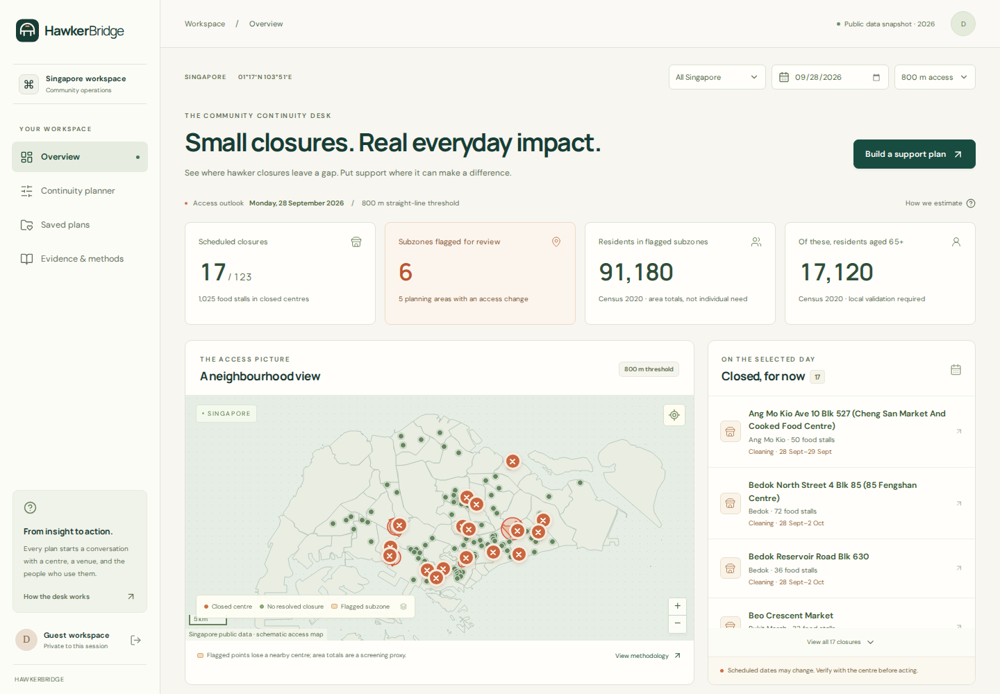
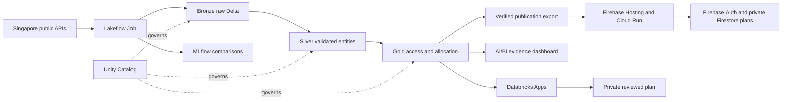

# HawkerBridge

**Keep the neighbourhood at the table.** A closure continuity desk for Singapore community teams.

A closure calendar answers *when*. HawkerBridge helps a coordinator decide *where to check, what to change, and what a support plan can afford*. It joins real NEA closure schedules to Census 2020 demographics and URA boundaries, compares neighbourhood access, and allocates assumed meal support under explicit budget and capacity constraints.

Built for **DAISI Singapore 2026, C3: KopilamAI**. Project owner: **Shivam Gupta**.

[Try HawkerBridge](https://hawkerbridge-sg.web.app) · [Submission and demo guide](START_HERE.md) · [Verified screenshots](docs/screenshots/README.md)



> **Execution status:** the real Databricks pipeline completed successfully, passed 12 data checks and recorded nine cloud scenarios in MLflow. The public Firebase app uses that verified publication. Three tabular sources were fetched live; two checksummed URA geometry archives were reused. The separate local benchmark contains 15 scenarios. [Execution evidence](data/processed/databricks-publication.json) and [release status](submission/deployment-status.json) record what ran. No measured social impact is claimed.

## Try the hosted app

Open **https://hawkerbridge-sg.web.app**. Choose **Explore as a guest** for an isolated trial, or create an email/password account to revisit your saved plans. Managed Firebase Authentication handles hosted accounts, and Firestore preserves plans across container updates. Guest work expires after seven days and is removed on guest logout. Account settings support deletion. Guest plans are not transferred when you sign in to a named account. [Judge testing instructions](submission/testing-instructions.md).

## Run in three commands

Prerequisites: Python 3.11+, [uv](https://docs.astral.sh/uv/getting-started/installation/) and Node.js 22+. No API keys, paid LLM or map service are required for the local application.

```sh
uv sync --frozen --extra dev
npm --prefix frontend ci && npm --prefix frontend run build
uv run python scripts/start_app.py
```

Open **http://127.0.0.1:8000**. Select **Explore as a guest**, or create a local account to retain access across visits. Each guest receives a separate private session. There are no seeded passwords. Local accounts are intended for the local evaluation environment; Databricks Apps uses workspace authentication.

The included checksummed public-data snapshot makes the demo reproducible without network access. To fetch updated government data:

```sh
uv run python scripts/refresh_data.py
uv run python scripts/evaluate_model.py
```

Restart the app to adopt the new validated snapshot. Refresh is atomic: failed acquisition or validation does not replace the last good data. A stale evaluation is not shown as evidence for a new snapshot.

## The useful demo

1. Set the date to **28 September 2026**. The source records 17 scheduled centre closures and 1,025 listed food stalls within those centres.
2. Inspect the flagged subzones and change the planning-area scope. Cross-boundary food alternatives remain in the analysis.
3. In **Continuity planner**, test moving selected cleaning closures out of that date. Renovation closures stay in place. This is a counterfactual, not a changed official schedule.
4. Generate a plan with S$1,500/day, S$300/site setup, S$4/meal, three candidate sites, 150 meals/site and 5% assumed uptake. The national scenario allocates **225 assumed meals**.
5. Increase the budget to S$3,000, then S$6,000. Both allocate **450 meals**, costing S$2,700. The three-site capacity ceiling is the binding constraint.
6. Save the proposal, record local checks, mark it reviewed, and export PDF/CSV/JSON. The saved record preserves its source manifest and model fingerprint.

These outputs are scenario calculations. A candidate locality is a subzone representative point, not a booked venue. Population in a flagged subzone is not a count of people experiencing food insecurity.

## What is implemented

| Layer | Implemented behavior |
|---|---|
| Data | Paginated HTTPS acquisition, retry/backoff, schema and geographic validation, closure quarantine, raw checksums, atomic publication |
| Analysis | Dated closure overlap, cooked-food-only alternatives, geographic scope, access screening, senior demographics, coverage and density |
| Optimisation | Integer meal allocation with geographic reach, no double-counting, budget, setup costs, site capacity and maximum sites |
| Evaluation | Largest-demand-first baseline, independently audited constraints, exhaustive tiny-instance tests, fixed scenario grid and sensitivity |
| Product | Responsive React interface, offline map geometry, calendar, scenario comparison, saved plans, review, briefs and PDF/CSV/JSON |
| Security | Managed Firebase identity in public hosting; Argon2id locally; HttpOnly sessions, CSRF/origin checks, shared throttling, owner-scoped plans, optimistic edit conflicts and escaped exports |
| Public hosting | Firebase Hosting, Cloud Run in Singapore, private Firestore plans, managed sessions and hourly bounded guest cleanup |
| Databricks | One serverless job, Bronze/Silver/Gold Delta tables, Unity Catalog grants, MLflow experiments, native AI/BI evidence dashboard, SQL queries and Databricks Apps configuration |

The optimiser uses **SciPy/HiGHS mixed-integer programming**, not a prediction trained on invented demand labels. Within the predeclared nine primary benchmark scenarios, it improves the chosen policy-weighted allocation objective by **0.3–9.2%** over the baseline (median 8.8%). All 15 unique primary/sensitivity scenarios pass independent feasibility checks. [Protocol and full results](docs/evaluation.md).

## Databricks deployment

Use the [Databricks deployment runbook](docs/databricks-deployment.md) and the separate [Firebase release runbook](docs/firebase-deployment.md). With an authenticated Databricks CLI profile and the Free Edition SQL warehouse ID:

```sh
uv run python databricks/bootstrap.py --profile YOUR_PROFILE --warehouse-id YOUR_WAREHOUSE_ID
```

Confirm the exact flags with `--help` before running. The bootstrap authenticates, builds the frontend, validates and deploys the bundle, executes the pipeline, verifies the published snapshot, then starts the app. Record real run and app URLs in `submission/deployment-status.json`.



The source manifest, model inputs and published results carry one publication ID. Failed runs never silently fall back to archived data. App identity grants are limited to its published snapshot, evaluation and plan tables. Stored plan ownership is enforced in application queries; deployment must keep these tables private from ordinary workspace users.

**Free Edition is the challenge environment. Its terms exclude commercial production use.** A paid pilot needs a suitable paid workspace or another licensed production deployment. [Business case and cost assumptions](docs/business-case.md).

## Data and limitations

Five named datasets come from **data.gov.sg**: NEA closure dates, SingStat Census 2020 population by age/subzone, URA planning-area boundaries, URA subzone boundaries, and NEA national waste totals. Exact identifiers, licenses, transport URLs, collection times and SHA256 checksums are in [the catalogue](data/sources.json) and [snapshot manifest](data/processed/snapshot.json).

The release contains 123 listed facilities, 120 with food stalls, 507 resolved closure intervals, 332 subzones and 55 planning areas. Thirty-two ambiguous intervals are quarantined, including unknown dates and staggered block closures. All five delivered baseline sources were downloaded from official endpoints.

- Population is **observed Census 2020**, not an estimated 2026 population.
- Straight-line distances from representative points are a screening proxy, not walking or wheelchair routing.
- Listed hawker centres omit coffee shops, food courts, home cooking and delivery. Zero-food market facilities are excluded as cooked-food alternatives.
- Unresolved closure dates mean “unknown”, not confirmed operation. National waste totals do not measure hawker-level waste or intervention outcomes.
- Uptake, cost, capacity and senior weighting are user-controlled assumptions. A coordinator must validate venues, actual need, operating capacity and dietary requirements.

See [model review](docs/model-review.md) and [opportunity research](docs/opportunity-research.md) for the constraints behind the design.

## Verify

```sh
uv run ruff check backend tests scripts databricks
uv run pytest -q
npm --prefix frontend test
npm --prefix frontend run build
npm --prefix frontend audit --audit-level=high
```

The GitHub Actions workflow runs backend, frontend and Chromium browser checks, then attempts to save screenshots, traces, video and exported-plan evidence as an artifact. Selected evidence also has a checksum-verified CI-log fallback when GitHub artifact storage is full. Browser tests live in `browser-tests/`. They cover account creation, authenticated planning, advanced-form validity, scope, saving, review, download, independent accounts and mobile overflow.

## Submission pack

- **Round 1:** `output/pdf/hawkerbridge-round1.pdf`, based on the official three-slide template.
- **Round 2:** `output/pdf/hawkerbridge-final-pitch.pdf` and its editable presentation, plus product screenshots.
- **Narrated demo:** [175-second video](output/video/hawkerbridge-demo-narrated.mp4), [caption track](submission/hawkerbridge-captions.srt) and [recording guide](submission/recording-guide.md). The public hosted workflow is recorded directly; the generic AI narrator is disclosed.
- **Narration and storyboard:** [video script](submission/video-script.md) and [printable narration](output/pdf/hawkerbridge-video-narration.pdf).
- **Supplementary one-page note:** [concept note](output/pdf/hawkerbridge-concept-note.pdf).
- **Ready-to-adapt copy:** [Devpost description](submission/devpost-description.md), [judge Q&A](submission/judge-qa.md), [what’s next](submission/whats-next.md).
- **Participant details:** fill `submission/team.json`, then run `uv run python scripts/check_submission.py --round 1`.

The participant must confirm Singapore IHL eligibility and institution/course/year/email. The checker deliberately blocks incomplete metadata. Round 2 also requires a verified workspace deployment and a public or unlisted video link. The guide gives the Round 1 deadline as **6 October 2026, 11:59 PM SGT**.

## Ownership and attribution

Shivam Gupta initiated the brief, defined the product goals and owns the project. Research, implementation, testing and artifact preparation used AI coding assistance. The repository documents actual work and evidence without inventing personal coding contributions, customer interviews, sales or measured outcomes. Shivam makes the final submission decisions. The supplied demo uses a disclosed generic AI narrator, not an imitation of his voice.

Code is MIT licensed. Government datasets retain the **Singapore Open Data Licence** and source attribution. The official Round 1 template belongs to the DAISI organisers. Third-party software retains its own licenses. [Attributions](NOTICE.md).
