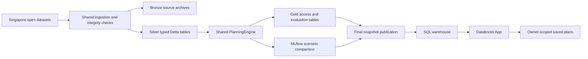

# Deploy HawkerBridge on Databricks Free Edition

**Status: deployment artifacts are implemented and locally tested. No Databricks workspace run, cloud table creation, MLflow run or hosted app is claimed until the steps below succeed in an authenticated workspace.**

The application has a complete local path and an explicit Databricks path. Workspace mode loads its snapshot and saves proposals through the SQL Statement Execution API; it never substitutes a local dataset after a workspace error. A real challenge submission should include evidence of this workspace path running.

## What is deployed

The bundle creates one Lakeflow Job with **one serverless notebook task**, one MLflow experiment, one Databricks App and one AI/BI evidence dashboard. It reuses an existing SQL warehouse. It does not create a cluster, serving endpoint, vector index, account-level resource or recurring schedule.



Unity Catalog holds the dedicated schema, table descriptions, source provenance, quality audit and explicit Python transformation lineage. SQL views also provide native query lineage. Do not imply that Python driver transformations automatically produce complete Unity Catalog column lineage: `lineage_edges` records the application-level relationships explicitly.

The [official serverless bundle examples](https://docs.databricks.com/aws/en/dev-tools/bundles/examples#job-that-uses-serverless-compute) describe notebook tasks without clusters and environment specifications. The [bundle resource reference](https://docs.databricks.com/aws/en/dev-tools/bundles/resources) documents the job, experiment and app fields used here.

## 1. Prepare access once

Sign in to a [Databricks Free Edition workspace](https://www.databricks.com/learn/free). Use the user's own identity and complete any sign-in verification. Nothing in this repository automates identity verification or stores credentials.

Install the current [official Databricks CLI](https://docs.databricks.com/aws/en/dev-tools/cli/install), then authenticate with a named profile:

```bash
databricks auth login --host https://YOUR-WORKSPACE-HOST --profile DAISI
databricks current-user me --profile DAISI
databricks warehouses list --profile DAISI --output json
```

Copy the ID of the **existing serverless SQL warehouse**. Free Edition has one warehouse; do not provision another. Confirm the `workspace` catalog exists, or supply the actual catalog name. The deployment identity must be able to create a schema, managed tables and an experiment, deploy an app, and grant that app access to the specific tables.

Do not paste a token into a chat, YAML, notebook or source file. The CLI and SDK use [unified authentication](https://docs.databricks.com/aws/en/dev-tools/auth/unified-auth). Databricks supplies the app's OAuth identity automatically.

## 2. Run the fail-fast deployment script

From the repository root, with Python 3.11+ and Node/npm available:

```bash
uv sync --extra dev
uv run python databricks/bootstrap.py \
  --profile DAISI \
  --warehouse-id YOUR_EXISTING_WAREHOUSE_ID \
  --catalog workspace \
  --schema hawkerbridge \
  --app-name hawkerbridge
```

The script checks authenticated access, verifies the existing warehouse is serverless, checks archive integrity and required files, then runs `npm ci` and `npm run build`. It validates and deploys the bundle, runs the pipeline to completion, reads back the published snapshot, and finally deploys/starts the app. Every failure stops the sequence. The final output identifies the actual app URL, publication ID and MLflow run ID; an app still needs browser verification afterward.

`databricks bundle deploy` alone uploads source and resources. It does not prove the pipeline ran or the app restarted; the script follows it with both required `bundle run` commands. The [official Apps CI/CD guide](https://docs.databricks.com/aws/en/dev-tools/databricks-apps/cicd-github-actions) explains this deployment/start distinction.

The bundle includes `frontend/dist/**` despite the repository's Git ignore rule and excludes `.venv`, local state, `.env` files, node modules and research/output directories. The app receives `HAWKERBRIDGE_AUTH_MODE=databricks`, `HAWKERBRIDGE_STORAGE=databricks`, secure cookies, the selected catalog/schema, and a warehouse resource reference. The [warehouse resource documentation](https://docs.databricks.com/aws/en/dev-tools/databricks-apps/sql-warehouse) explains how `valueFrom` resolves the ID. The bundle equivalent uses `value_from` in its app config schema.

### Live acquisition and explicit archived replay

The default is **live** tabular acquisition with checksum-verified reuse of slowly changing archived URA geometry. Each source keeps its own retrieval date, transport URL and reuse timestamp. The delivered baseline's five datasets were acquired through official data.gov.sg endpoints; no mirror is required by the delivered archive.

To request fresh official geometry as well:

```bash
uv run python databricks/bootstrap.py --profile DAISI \
  --warehouse-id YOUR_EXISTING_WAREHOUSE_ID --fresh-geometry
```

[Free Edition limits](https://docs.databricks.com/aws/en/getting-started/free-edition-limitations) include restricted outbound internet and fair-use quotas. If the workspace cannot reach a public source, the live job fails and leaves the previous publication visible. It does not pretend an archive is live. An explicitly labelled replay is available for reproducibility or an honest fallback demo:

```bash
uv run python databricks/bootstrap.py --profile DAISI \
  --warehouse-id YOUR_EXISTING_WAREHOUSE_ID --input-mode archived_replay
```

Replay calls the same shared normalisation and validation code against checksummed source archives, then performs the actual Delta writes, optimisation evaluation and MLflow logging in Databricks. It demonstrates processing and serving archived public data, **not live acquisition**. For a fresh offline archive, refresh and commit the public sources locally first, preserving timestamps and provenance, then redeploy. Do not relabel old source observations as current.

## 3. Inspect the actual platform evidence

Select the deployed catalog/schema in the SQL editor. The notebook creates these managed tables:

| Layer | Tables | Purpose |
| --- | --- | --- |
| Bronze | `bronze_sources` | Full connector payload archives with source URLs, retrieval times, byte counts and SHA-256 |
| Silver | `silver_centres`, `silver_closures`, `silver_demand_zones`, `silver_boundaries`, `silver_food_waste`, `silver_quarantine` | Explicitly typed, validated national data and retained unresolved records |
| Gold | `gold_access_by_area`, `gold_access_zones`, `gold_evaluations`, `gold_snapshots` | Scenario outputs, genuine comparisons and complete app inputs |
| Governance | `quality_audit`, `lineage_edges`, `pipeline_events` | Publication gates, transformation records and run history |
| Application | `application_plans` | Owner-scoped saved proposals |

Every staged analytical row carries a `publication_id`. The final append to `gold_snapshots` is the visibility boundary after evaluations and MLflow logging complete. `published_*` SQL views filter to that publication. This is **not a cross-table ACID transaction**: incomplete staging remains auditable but is hidden from application inputs and published views. No table is dropped or replaced to publish new data, so grants remain intact. A future retention job should remove old staging/history only after a documented retention period; no destructive cleanup is automated here.

The bundle includes a [four-widget AI/BI evidence dashboard](../databricks/dashboard/README.md) for closure counts, optimiser comparison, provenance and quarantine. Its namespace and existing warehouse are bound through the bundle. Refresh and inspect the actual workspace dashboard after the pipeline succeeds. Use [the extended SQL query pack](../databricks/sql/dashboard_queries.sql) for additional publication status, demographics and density views. Pick one query per dataset and use the `evaluation_date` DATE parameter for the three precomputed evaluation dates. Other dates remain available dynamically in the app. The dashboard definition and query pack are supplied; actual cloud creation and rendering remain deployment verification steps.

Open the bundle's MLflow experiment. It contains a parent publication run and nine child scenarios: three predeclared dates × three budgets. The real engine produces planned meals, spend, weighted benefit, baseline weighted benefit, solver status and elapsed time. Every scenario is checked for budget feasibility and against the feasible baseline. Source manifest and evaluation JSON are logged as artifacts. These are **modelled decision objectives**, not predictive accuracy, observed meal demand or people helped. No trained model is fabricated or registered just to add a platform feature.

## 4. App permissions and login

The bundle binds the existing SQL warehouse with `CAN_USE`. Once the app resource exists, the pipeline obtains its `service_principal_client_id` from the workspace Apps API and grants only:

- `USE CATALOG` on the selected catalog and `USE SCHEMA` on the dedicated schema;
- `SELECT` on `gold_snapshots` and `gold_evaluations`;
- `SELECT, MODIFY` on `application_plans`.

It does not grant access to all tables, create account-level principals or put an API token in the app. If the deployment identity cannot grant these privileges, the job stops before publishing. Have the workspace/catalog owner grant the specific missing privilege; do not broaden access to every user. The [official Apps authorization documentation](https://docs.databricks.com/aws/en/dev-tools/databricks-apps/auth) describes the app service principal; [Unity Catalog table resource guidance](https://docs.databricks.com/gcp/en/dev-tools/databricks-apps/tables) explains the parent and table privileges.

Users sign in through the Databricks platform and need access to the app. Do not enable Databricks mode behind an arbitrary public proxy or forge platform identity headers. The API derives the owner from platform identity; request bodies cannot select an owner. Storage uses named SQL parameters and bounds polling, cancellation and complete chunk retrieval. It refuses failed, truncated, malformed or incomplete results. [Statement Execution API reference](https://docs.databricks.com/api/statement-execution/v1/statement-execution)

Owner filtering is enforced by the application. The app service principal can access all app plan rows, so this is not database-enforced per-user row security. Workspace administrators and principals with direct table privileges can inspect those rows. Do not store beneficiary identities or sensitive case notes. A commercial deployment needs tenant isolation, retention and governance appropriate to its data.

The app takes an immutable snapshot at process start. After a new pipeline publication, rerun/start the app to pick up the new snapshot. Evaluation retrieval uses that snapshot's fingerprint so a newer cloud evaluation is never paired with older running inputs. The pipeline also hashes the imported engine implementation and stores that SHA-256 in the manifest, scenario results and MLflow artifacts. The store requires one consistent engine hash across the publication; historical reports without it fail closed. The API compares the report hash with its running engine, so redeploying changed planning code requires a new evaluation before the report is current.

## 5. Verification checklist before recording

Record results in the deployment evidence log; do not check items from code inspection alone.

- [ ] Authenticated `bundle validate` succeeds against the selected workspace and current CLI.
- [ ] The one-task serverless job finishes successfully with the intended `input_mode`.
- [ ] Bronze rows contain actual source payloads and checksums; source retrieval dates are visible.
- [ ] Structured Silver/Gold rows, quarantine, quality checks and the final publication ID are queryable.
- [ ] MLflow has the actual nine scenario runs and artifacts matching the publication fingerprint and imported engine-code SHA-256.
- [ ] SQL cooked-food density reconciles to 120 food centres; the separate inventory measure reconciles to 123 records, including three zero-food-stall markets.
- [ ] The app starts and the health check succeeds without a local-data fallback.
- [ ] A fresh signed-in browser session can inspect a closure, change assumptions, optimise, save, reload and export a proposal.
- [ ] Two authorised workspace users cannot read, modify or export each other's saved plans by changing a URL ID.
- [ ] A missing warehouse ID, revoked table privilege or unavailable warehouse produces an explicit error rather than an apparently successful local mode.
- [ ] Source mode, Census year, unresolved closures and representative-point caveats are visible in the recorded story.
- [ ] The judge-accessible app/notebook/repository links work with the intended access permissions.
- [ ] The app is restarted before demo recording; Free Edition apps can auto-stop after 24 hours.

Capture the workspace hostname (no token), job run URL, publication ID, input mode, MLflow run URL, app URL and dated screenshots in your private deployment evidence. Store public screenshots only after checking them for sensitive details.

## Local verification and its limits

The platform tests exercise SQL state polling, cancellation, result chunks, owner bindings, lightweight plan listing, snapshot/evaluation fingerprint alignment, checksum rejection and publication failure boundaries. A strict local Spark-shaped adapter also checks table row types while the real Python planning engine executes all nine scenarios. It does **not** execute Spark SQL, Delta Lake writes, workspace OAuth or cloud permissions.

The bundle YAML has been checked against the official Databricks CLI JSON Schema. Authenticated `databricks bundle validate`, a real notebook run and the browser checks above remain separate requirements. The included runtime code should be treated as deployment-ready source pending those environment-specific verifications, not proof of a production deployment.

## Operating cost and production boundary

There is no scheduled job or continuously running model endpoint. Run refreshes when preparing new data, keep the warehouse small and stop the app outside testing. Free Edition quotas and non-commercial terms are incompatible with a production availability promise. A paying service would require an appropriate paid Databricks environment, monitored data freshness, defined retention, stronger tenant controls, operational ownership and verified demand/venue integrations. Budget those explicitly rather than describing the free challenge workspace as a commercial production service.
